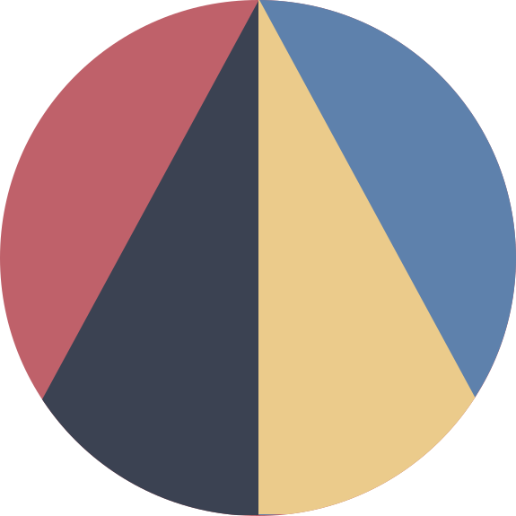
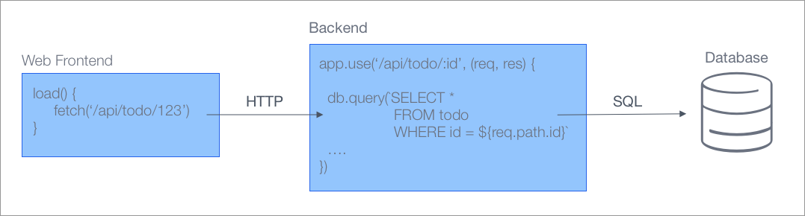
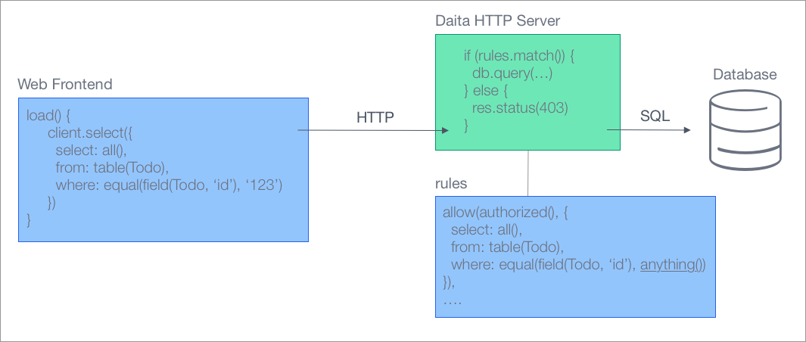

<h1 align="center">
  
</h1>
<h2 align="center">Daita</h2>

  
  

## Motivation
The daita project aims to make the development and deployment of web applications easier, faster and safer. 
Daita does this by removing the need for a backend service to access and store data.

## Documentation and examples
The Documentation and getting started guide is available at [docs.daita.ch](https://docs.daita.ch/). 
There is also an example project located in the [src/examples](./src/examples) folder.

## Why use daita

<table border="0">
  <tr style="background-color: transparent">
	<td align=right width="50%" style="border: 0; width: 50%" background="transparent">
        
    </td>
    <td style="border: 0">
        Daita lets you focus on your business, and we'll do the chores. Go
        ahead check out our demos and docs.
    </td>
  </tr>   
  <tr style="background-color: transparent" background="transparent">
  	<td align=right width="50%" style="border: 0; width: 50%">
        Daita was designed from the ground up to be as lightweight as possible
        and have a minimum of external dependencies.</td>
    <td style="border: 0">
        
    </td>
  </tr> 
  <tr style="background-color: transparent">
  	<td align=right width="50%" style="border: 0; width: 50%">
        
    </td>
  	<td style="border: 0">
        Catch errors early during compile time, but keep flexibility without adding more build tools.
        Everything works with plain typescript and requires no additional build steps.
    </td>
  </tr>
  <tr style="background-color: transparent">
  	<td align=right width="50%" style="border: 0; width: 50%">
        Take more control over the way it's allowed to execute a query and which data can be accessed.
    </td>
  	<td style="border: 0">
        
    </td>
  </tr>
  <tr style="background-color: transparent">
  	<td align=right width="50%" style="border: 0; width: 50%">
        
    </td>
  	<td style="border: 0">
        Take advantage of the complete set of SQL capabilities with additional type checks and linting rules.
    </td>
  </tr>
  <tr style="background-color: transparent">
  	<td align=right width="50%" style="border: 0; width: 50%">
        Generate sql migrations with the powerfull daita cli with support for backward compatible schema changes.
    </td>
  	<td style="border: 0">
        
    </td>
  </tr>
</table>

## How does it work?

### Usual architecture

### Daita architecture

### Packages
| Package | Description | Downloads | Coverage | Status |
| --- | --- | --- | --- | --- |
| @daita/relational | SQL abstractions for accessing relational databases |  | | beta |
| @daita/orm | An OR mapper which handles schema migrations for relational databases |  | | alpha |

### Adapters
| Package | Description | Downloads | Coverage | Status |
| --- | --- | --- | --- | --- |
| @daita/pg-adapter | Postgres adapter |  | | alpha |
| @daita/sqlite-adapter | Sqlite adapter |  | | - |
| @daita/http-adapter | HTTP adapter |  | | alpha |

### Development & Tooling

| Package | Description | Downloads | Coverage | Status |
| --- | --- | --- | --- | --- |
| @daita/create | Bootstrapping and initalizing new daita projects using `npm init @daita` or `npx @daita/create` |  | | alpha |
| @daita/cli | A cli used during development to generate migrations and diagrams |  | | alpha |
| @daita/eslint-config | Linting rules for daita related code |  | | alpha |
