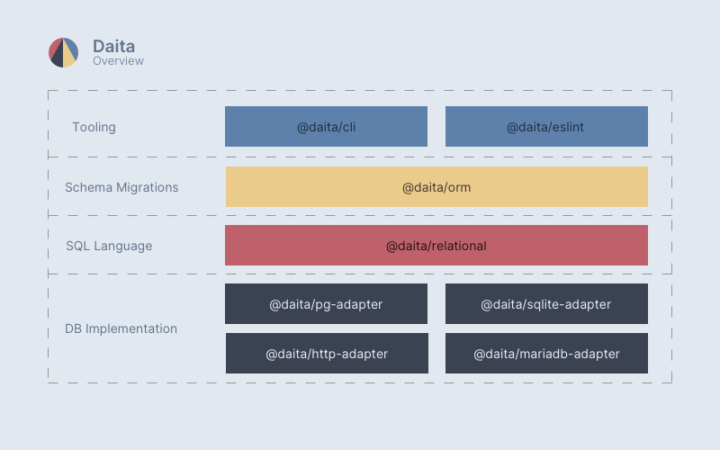

<h1 align="center">
  
</h1>

# Daita

Daita provides an easy way to interact with relational databases. 
It's goal is to provide the full flexibility of sql within the typescript syntax to provide the best developer experience.

## Quick Overview
Daita contains different multiple modules with diffrent purposes.

- **Postgres / SQLite / MariaDB Adapter**

  Database drivers for connecting, formatting and executing sql commands.
- **Http Adapter**

  Database proxy to use relational databases over HTTP.
- **Relational**

  SQL Language interfaces and query builder functions.
- **ORM**

  Schema definition and table/data migrations.
- **cli**

  Generating and applying database migratings.
- **eslint**
  
  Enforcing best practices and preventing invalid sql queries.

## Getting started

## API Documentation

usage
relational
eslint
cli