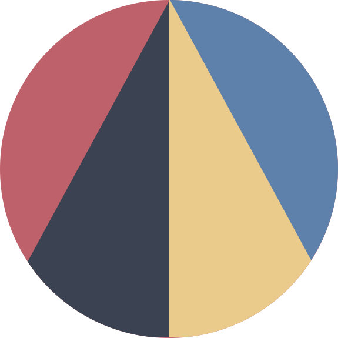

# Introduction

## [](https://daita.ch) TLDR

Daita provides an easy way to interact with relational databases. It's goal is to provide the full flexibility of sql within the typescript syntax to provide the best developer experience.

```typescript
// fetch the 5 highest mountains
const mountains = await client.select({
    select: {
       mountain: field(Mountain, 'name'),
       height: field(Moutain, 'height'),
    },
    from: table(Mountain),
    orderBy: desc(field(Moutain, 'height')),
    limit: 5,
})
// const mountains: { mountain: string, height: number }[]
```


### Quick Overview

Daita contains different multiple modules with different purposes. They build on top of each other, but can be used independently.


*   **Postgres / SQLite / MariaDB Adapter**

    Database drivers for connecting, formatting and executing sql commands.
*   **Http Adapter**

    Database proxy to use relational databases over HTTP.
*   **Relational**

    SQL Language interfaces and query builder functions.
*   **ORM**

    Schema definition and data migrations with support for schemas, tables, indices and views.
*   **cli**

    Setting up new projects, generating and applying database migrations.
*   **eslint**

    Enforcing best practices and preventing invalid sql queries.
